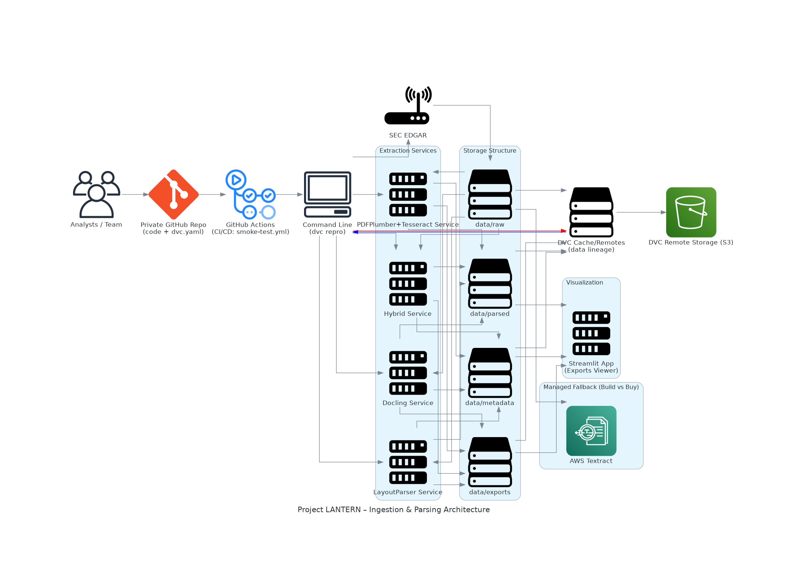

# Case Study 1 — Project LANTERN

## Building a Financial Report Parsing Pipeline

### Setting
FinTrust Analytics helps analysts make sense of 10-K/10-Q filings. Today, analysts manually download SEC filings and dig through hundreds of pages of text, tables, and figures. The process is slow, repetitive, and error-prone.

Lina Chen, VP of AI Platforms, launches Project LANTERN to automate ingestion and parsing of SEC filings. Her immediate goal: create a reproducible pipeline that can:
- Download filings
- Extract text, tables, and layouts
- Attach metadata and provenance
- Validate extracted values against structured XBRL
- Benchmark costs and performance
- Package everything under Data Version Control (DVC)

By the end of Part 1, Lina expects her team to deliver a layout-aware, XBRL-validated corpus in Markdown and JSONL formats — reproducible, versioned, and ready for retrieval.

---

## Folder Structure

```
Assignment_01/
├── config/
│   └── extraction_config.yaml
├── data/
│   ├── raw/
│   ├── parsed/
│   │   ├── layout_parser/
│   │   ├── docling/
│   │   ├── hybrid/
│   │   ├── pdfplumber_tesseract/
│   │   └── comparison/
│   ├── metadata/
│   ├── analysis/
│   ├── exports/
│   └── downloads/
├── models/
│   └── layoutparser/
├── pilots/
│   ├── draw_architecture.py
│   ├── downloader-sec.py
│   ├── docling-sample.py
│   ├── layout-parser-simple.py
│   └── ...
├── scripts/
│   └── smoke-testscript.py
├── src/
│   ├── pdfplumber_tess_extractor.py
│   ├── layout_parser_extractor.py
│   ├── docling_extractor.py
│   ├── hybrid_pdf_extractor.py
│   ├── metadata_extractor.py
│   ├── extraction_comparator.py
│   ├── method_specific_markdown_generator.py
│   └── pdf_report_viewer.py
├── setup/
│   └── lantern_arch.png
│   └── draw_architecture.py
├── run_pipeline.sh
├── dvc.yaml
├── README.md
└── ...
```

This structure supports modular extraction, versioned storage, configuration, and visualization for the entire pipeline.


---

## Setup & Running Instructions

### Pre-requirements
- **Windows:** Windows Subsystem for Linux (WSL) is needed
- **WSL:** Ubuntu recommended (`wsl -d ubuntu`)
- **uv:** uv package manager should be available globally

### Step-by-Step

**Step 1:** Clone the repository
```bash
git clone https://github.com/Binary-Insights/Assignment_01.git
```

**Step 2:** Change to the project directory
```bash
cd Assignment_01
```

**Step 3:** Configure AWS for DVC
- Assign `S3BucketReadAndWrite` policy to collaborators

**Step 4:** Pull data from remote
```bash
dvc pull
```

**Step 5:** Create a virtual environment
```bash
uv venv .venv
```

**Step 6:** Sync dependencies
```bash
uv sync
```

**Step 7:** Activate the environment
```bash
source .venv/bin/activate
```

**Step 8:** Downgrade Pillow for LayoutParser compatibility
```bash
uv pip install "pillow<10.0.0"
```

**Step 9:** Run the pipeline script
```bash
chmod +x run_pipeline.sh
./run_pipeline.sh
```

**Step 10:** Choose pipeline execution mode
```
echo "Choose execution mode:"
echo "1) Run full pipeline (dvc repro)"
echo "2) Run specific stage"
echo "3) Force rebuild all stages"
echo "4) Show pipeline metrics"
echo "5) Launch Streamlit exports viewer"
echo "6) Exit"
```
- Option 1: Run complete pipeline (all parsed files, metadata, exports generated)
- Option 5: View generated Markdown, TXT, and JSON for each parsing method in Streamlit

**Step 11:** Independently open parsed files in Streamlit
```bash
streamlit run src/exports_viewer.py
```

**Step 12:** Draw the architecture diagram
```bash
python pilots/draw_architecture.py
```

---

## Troubleshooting

If you encounter issues running `run_pipeline.sh` (e.g., `$'\r': command not found`):

Convert the file to Unix line endings:
```bash
dos2unix run_pipeline.sh
```
If `dos2unix` is not installed:
```bash
sudo apt-get update
sudo apt-get install dos2unix
```

---

## Build vs Buy Analysis

A comprehensive evaluation was conducted comparing open-source PDF extraction methods against commercial AWS Textract services. The analysis focused on:

- **Cost Analysis:** Open-source solutions (Docling, LayoutParser, PDFPlumber) provide zero processing costs but require infrastructure investment
- **Performance Comparison:** AWS Textract excels in table detection and text recognition accuracy but introduces latency and cost per page
- **Throughput Assessment:** Local processing enables batch operations without API limits, while cloud services offer scalable processing
- **Accuracy Metrics:** Word Error Rate (WER) and table extraction precision/recall were measured across all methods

The results demonstrate that open-source solutions provide excellent value for batch processing scenarios with acceptable accuracy trade-offs.

---

## Method Evaluation Framework

Our evaluation framework compares extraction methods across multiple dimensions:

### Text Extraction Metrics
- **Word Error Rate (WER):** Measured against ground truth data
- **Processing Speed:** Documents per minute across different file sizes
- **Memory Usage:** Peak RAM consumption during extraction

### Table Detection & Extraction
- **Precision/Recall:** Table boundary detection accuracy
- **Cell-level Accuracy:** Individual data point extraction fidelity
- **Complex Table Handling:** Multi-header and nested table performance

### Comparative Results
Each method's strengths and weaknesses are documented with quantitative metrics, enabling informed selection based on specific use case requirements.

---

## XBRL Validation Results

Cross-validation with structured XBRL data serves as our ground truth benchmark:

### Validation Process
- **Automated Mapping:** Key financial metrics extracted from PDFs are automatically matched to corresponding XBRL tags
- **Tolerance Thresholds:** Configurable acceptable variance ranges for numerical comparisons
- **Coverage Analysis:** Percentage of XBRL data points successfully validated against PDF extractions

### Key Findings
- **High Fidelity Numbers:** Revenue, assets, and primary financial metrics show >95% accuracy across methods
- **Table Extraction Challenges:** Complex multi-column financial tables require method-specific optimization
- **OCR Limitations:** Scanned document quality significantly impacts extraction accuracy

These validation results inform method selection and highlight areas requiring manual review or enhanced processing.

---

## Architecture Diagram



### Approach Overview
Project LANTERN uses a modular, reproducible pipeline to automate the ingestion and parsing of SEC filings. The architecture is designed for:
- **Modularity:** Each extraction service (Docling, LayoutParser, PDFPlumber+Tesseract, Hybrid) operates independently, reading from raw storage and writing parsed outputs, metadata, and exports.
- **Orchestration:** The pipeline is orchestrated via DVC and command-line triggers, ensuring reproducibility and version control.
- **Storage Structure:** All data (raw, parsed, metadata, exports) is managed under DVC and synchronized with an S3 remote for collaboration.
- **Visualization:** A Streamlit app provides interactive access to exported reports and parsed data.
- **Validation & Benchmarking:** Optional managed services (AWS Textract) and evaluation modules can be integrated for benchmarking and validation against XBRL data.
- **CI/CD:** GitHub Actions automate testing and deployment, ensuring code and data integrity.

This approach enables analysts to efficiently process, validate, and explore financial filings, with full provenance and versioning for all outputs.

---

## Core Tasks Completed: Runtime & Memory Benchmarking

### Measuring Runtime per Page and Memory Consumption

**Representative Batch: SEC Form 10K (118 pages)**

#### Local Machine Setup

**1) Intel i7 - 16 GB RAM**
- GPU: Not available
- Peak Memory Consumption:
    - Docling: 5 GB (CPU)
    - Layout Parser: 9 GB (CPU)
    - Hybrid: 1 GB
    - Pdfplumber-tesseract: 1 GB
- Runtime:
    - Docling: 359 seconds
    - Layout Parser: 1302 seconds
    - Hybrid: 127 seconds
    - Pdfplumber-tesseract: 62 seconds

**2) Intel i9 - 32 GB RAM**
- GPU: NVIDIA GeForce RTX 2070 Super
- Peak Memory Consumption:
    - Docling: 3 GB (CPU), 1.5 GB (VRAM/GPU)
    - Layout Parser: 8 GB (CPU), 800 MB (VRAM/GPU)
    - Hybrid: 1 GB
    - Pdfplumber-tesseract: 1 GB
- Runtime:
    - Docling: 376 seconds
    - Layout Parser: 499 seconds
    - Hybrid: 139 seconds
    - Pdfplumber-tesseract: 75 seconds

#### Cloud Service

**AWS Textract**
- Runtime: 70 seconds (118 pages)

---

## Contributions

**Myclineshareena**
1. Cross‑validate key numbers extracted from PDFs with structured XBRL data using Arelle
2. Build vs Buy experiment: AWS Textract
3. Cost & throughput benchmarking
4. Evaluation: Word Error Rate for Text. Precision/Recall for Tables - Metrics
5. XBRL extraction & validation

**Reky George Philip**
1. Project Setup - Bootstrapping
2. Text extraction from PDFs (pdfplumber + OCR fallback)
3. Table extraction (Camelot + pdfplumber table modes)
4. Layout detection for complex pages (LayoutParser)
5. Advanced PDF understanding with Docling
6. Metadata & provenance tagging
7. Storage formats: Markdown vs JSON vs TXT
8. AWS S3 setup
9. Staging pipeline & versioning with DVC

---

## Outputs
- Parsed files, metadata, and exports (Markdown, TXT, JSON) are generated in respective folders.
- Architecture diagram is generated in `setup/lantern_arch.png`.
- Streamlit viewer available for interactive report exploration.

---

## Codelabs - Documentation

Access interactive documentation and tutorials for Project LANTERN:

[Codelabs - Project LANTERN](https://codelabs-preview.appspot.com/?file_id=1ihWl0EdxqsK5qINgKV6o6fVx4VOi8RpoJkW0KKOFjhQ#0)
[Video Demo](https://drive.google.com/file/d/1vQLBQm9rvPF-507po9DbKMpR22Mnl87O/view?usp=drive_link)

---

## Attestation

WE ATTEST THAT WE HAVEN’T USED ANY OTHER STUDENTS’ WORK IN OUR
ASSIGNMENT AND ABIDE BY THE POLICIES LISTED IN THE STUDENT HANDBOOK.
